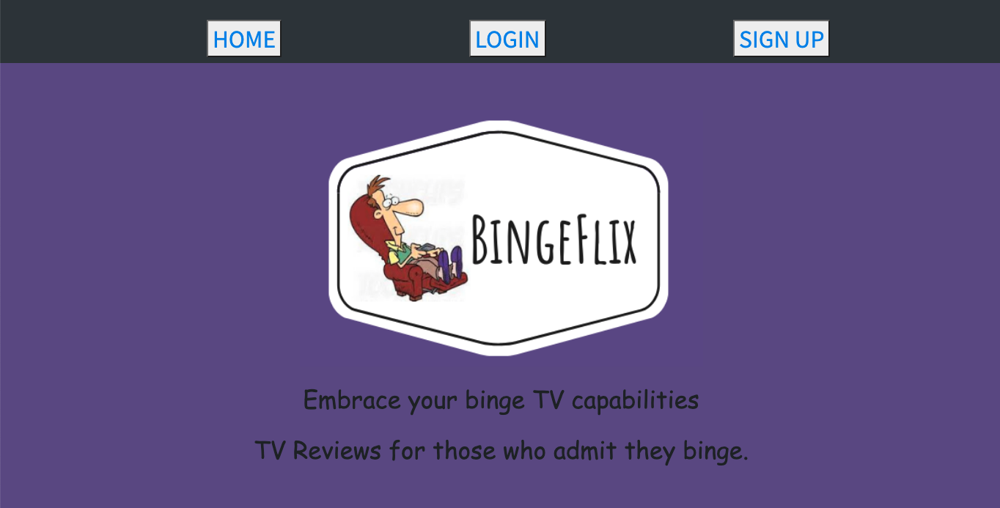

# BingeFlix

### Overview:
The app allows users to create their own reviews for their favorite or not so favorite TV shows. 
It allows users to see other people’s reviews as well as save their own reviews.

## Creators & Contributions:
+ Danielle Pollesche: [GitHub](https://github.com/pollesche02)
    * HTML
    * CSS
- Dylan Jambro: [GitHub](https://github.com/djambro44)
    * OMDB API
+ Jenen Neihart: [GitHub](https://github.com/neihartjenen)
    * Models & Associations
- Lindsey Tummond: [GitHub](https://github.com/lindseytummond)
    * OAuth
    * API and HTML Routes

## Motivations: 
-   Create a fun and interactive app to lookup TV shows via OMDB, create, and read TV reviews
-   Provide a simple application for admitting binging TV shows is fun!

## Learning Points:
- Utilization of GitHub and collaborating as a team, ensuring correct use of pulling and pushing items to respective branches and master branch.
- Understanding of multiple files, how to link file structure, interact as a team project, and use of Agile methodologies.

## Future Enhancements
-	Add a ‘like’ button to track other reviews from Users
-	Create a rending list for reviews
-	Incorporate the OMDB API with the user models

## Technologies:
-   HTML
-   CSS
-   Bootstrap
-   UI Kit
-   Javascript
-   jQuery 
-   AJAX 
-   MySQL
-   Sequelize
-   Express
-   Passport.js
-   OMDB
-   GitHub
-   Heroku

## How the app works:
Use the following link https://sheltered-depths-77546.herokuapp.com/ to open the application.  

1.	Users have the option to Sign Up if they are a new user or Log In if they have been to the app prior.
2.	Once authorization is complete, the left navigation bar allows the user to:
	*	Look Up Binges - Search via the OMDB API for shows
	*	View TV Reviews - Search all reviews posted on the app
	*	My TV Reviews - Track all reviews the logged in user has created
	*	Create TV Reviews - Add reviews for TV shows

## App Example:

  

